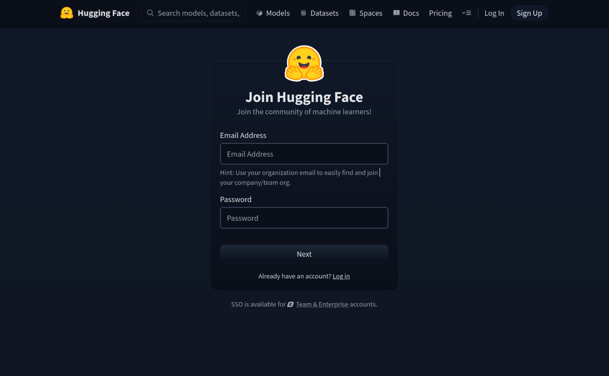
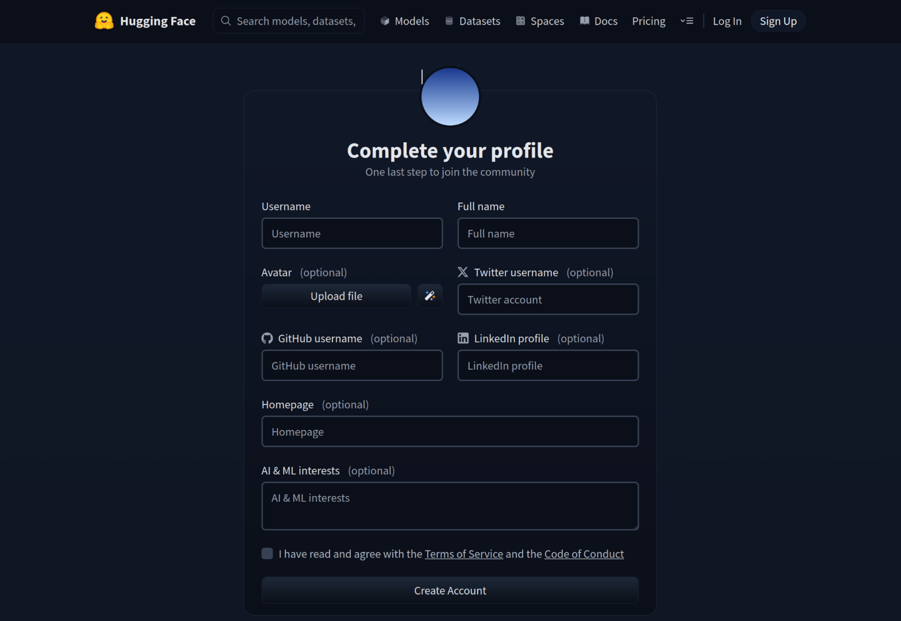
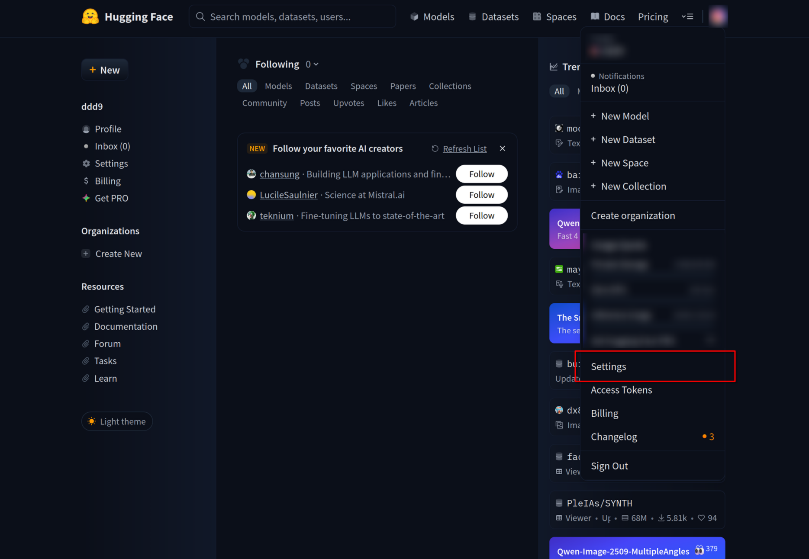
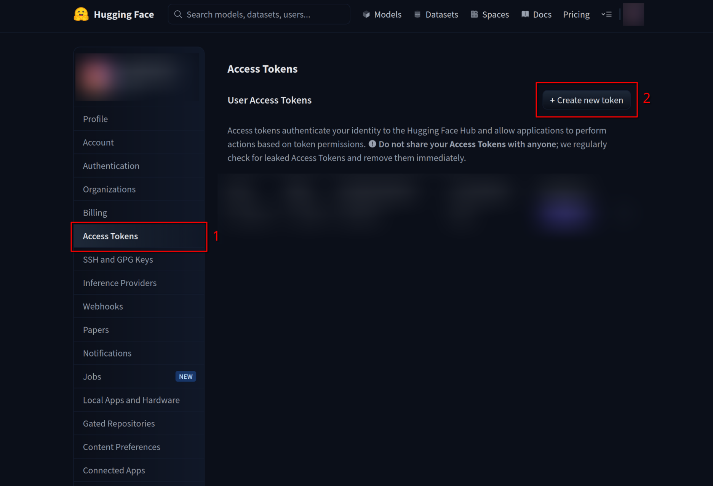
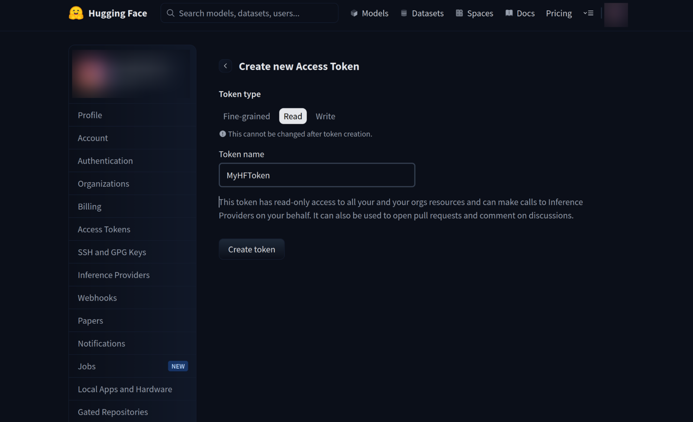
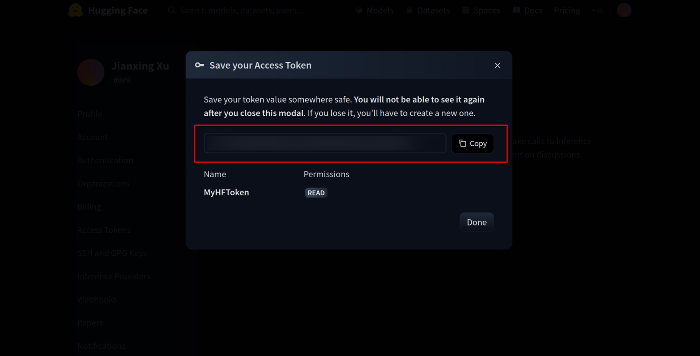
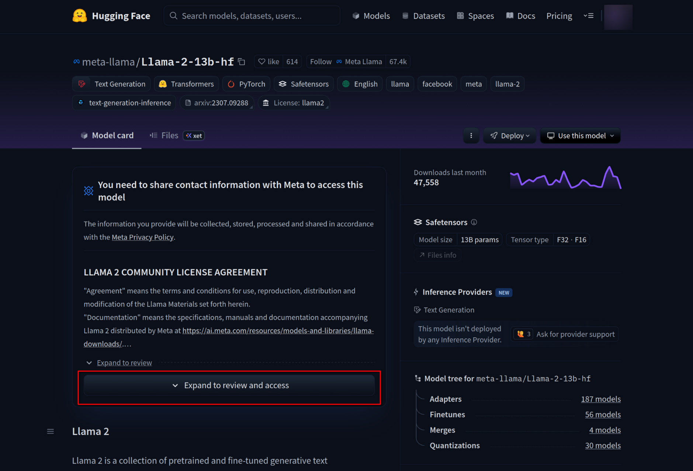
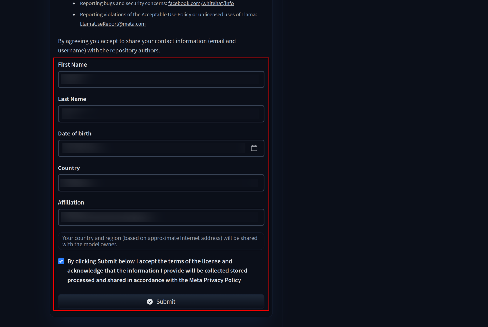

# 1. Introduction

This README file contains a guide on obtaining a HuggingFace token that grants access to the models used in the end-to-end generative accuracy benchmark presented in Table 2 of the FlashAttention-T paper.

# 2. HuggingFace Account Registration

To access the models, you need to have a HuggingFace account. If you do not have one, please follow these steps to create an account:

1. Navigate to the HuggingFace website: https://huggingface.co/ in your web browser.

2. Click on the "Sign Up" button located at the top right corner of the homepage. You should now see a registration form like the below screenshot. Fill in the required fields and click on the "Next" button to complete the registration process.

3. In the next web page shown in the below screenshot, fill in the required details such as Username, Full name and agree with the HuggingFace Terms of Service. Finally, click on the "Create Account" button to create your HuggingFace account. You might receive a verification email to verify your email address, please follow the instructions in the email to complete the verification process.

# 3. Generating HuggingFace Access Token

After successfully creating your HuggingFace account, you need to generate an access token to authenticate and access the models used in the benchmark. Please follow these steps to generate the token:

1. Log in to your HuggingFace account and navigate to your account settings by clicking on your profile picture at the top right corner and selecting "Settings" from the dropdown menu, as shown in the below screenshot.

2. Click on the "Access Tokens" tab located in the left sidebar of the settings page, then click on the "Create new token" button to enter the token creation page, as shown in the below screenshot.

3. In the token creation page, select the "Read" token type, fill in a name for your token (e.g., MyHFToken), and click on the "Create token" button to generate your access token, as shown in the below screenshot.

4. A window will pop up notifying you to copy and save the newly created token, as shown in the below screenshot. Please follow the instructions to copy and securely store your token (such as using the command `echo $YOUR_COPIED_TOKEN > hf_token`). This token will be used later (as introduced in the [README.md](../README.md) under the `flashattention-t-artifact/3-table2-end2end-generative-accuracy` directory) to download the models for the evaluation.

# 4. Requesting For Access to the Models Used in the Benchmark

The following models are used in the end-to-end generative accuracy benchmark in this artifact:

- Llama2 13B ([`meta-llama/Llama-2-13b-hf`](https://huggingface.co/meta-llama/Llama-2-13b-hf))
- Mistral Nemo (`[mistralai/Mistral-Nemo-Instruct-2407](https://huggingface.co/mistralai/Mistral-Nemo-Instruct-2407)`)
- Qwen3 14B (`[Qwen/Qwen3-14B-Base](https://huggingface.co/Qwen/Qwen3-14B-Base)`)

Out of these models, only the Llama2 13B model requires you to request access before downloading. Please follow these steps to request access:

1. Navigate to the Llama2 13B model page with your web browser: https://huggingface.co/meta-llama/Llama-2-13b-hf.

2. Click on the "Expand to review and access" button to read the model license, as shown in the below screenshot.

3. Slide down to read the full license agreement, then fill the request form with the required information and click on the "Submit" button to submit your access request, as shown in the below screenshot.

4. Once submitted, you will need to wait for the Meta team to review and approve your access request, as shown in the below screenshot. Generally you would be granted access within an hour, and you will receive a notification email once the request is approved.

While awaiting approval, you can still proceed to set up the environment and conduct evaluations with the other models (Mistral Nemo and Qwen3) that do not require access requests. Please refer to the [README.md](../README.md) under `flashattention-t-artifact/3-table2-end2end-generative-accuracy` directory for detailed setup and evaluation instructions.